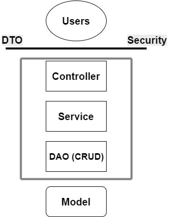
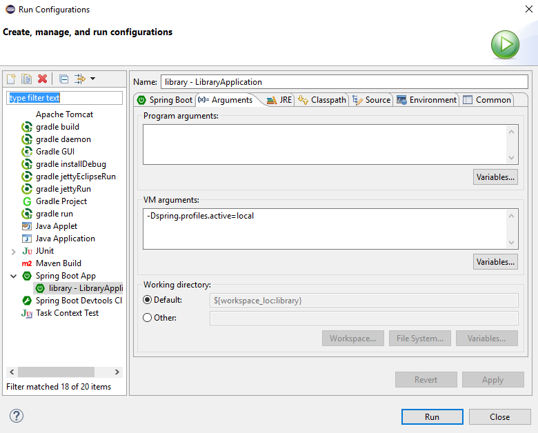

#Notas del cursillo de atSistemas
Este documento es un conjunto de notas tomadas en el cursillo de Agosto-Septiembre de 2016 realizado en atSistemas para el puesto de programador junior en Java. En este cursillo se expusieron muchas ideas, tanto a nivel de programación como de trabajo en equipo, de las que se habla a continuación.

[TOC]

###Objetivo del curso
El objetivo principal del curso fue desarrollar una **API RESTful**, en la que se utilizó:
* **Spring** como framework de Java. Versión 4.2 o superior.
* **Hibernate** como [ORM](https://es.wikipedia.org/wiki/Mapeo_objeto-relacional).
* **Java Persistence API** para mapear nuestras clases sin ser dependientes de Hibernate.
* **MySQL** como Base de Datos.
* **Gradle** como gestor de dependencias en lugar de Maven.
* **Dozer** como framework de mappeo entre clases Java.
* **JUnit** como framework de pruebas unitarias.
* **Mockito** para usar [mocks](https://es.wikipedia.org/wiki/Objeto_simulado) en nuestras pruebas.
* **Swagger** como framework para crear documentación online de nuestra API.
* **Eclipse** como entorno de desarrollo.
* **Postman** como aplicación de escritorio para probar nuestras APIs.
* **Spring Boot** para inicializar nuestra aplicación Spring con más facilidad. No se vio de forma explícita.
* **Joda Time** como framework de tratamiento de fechas. Opcional.

Esta lista de frameworks y herramientas fueron presentadas como **lo mejor de lo mejor** en el desarrollo de APIs web, y son las que la empresa utiliza a día de hoy para hacer todo tipo de proyectos. A lo largo del cursillo pudimos comprender en efecto la potencia de las mismas.

Téngase en cuenta que aunque el cursillo se limitó al desarrollo en Back-end, la API JSON se contruyó con la intención de que una **aplicación de AngularJS la utilizase**. AngularJS se ha mencionado como **una de las herramientas con más futuro de la actualizad informática**, y aunque no se considere aquí es muy recomendado su aprendizaje para los interesados en Front-End.

###API RESTful
Una API RESTful, en muy resumidas cuentas, es una aplicación que ofrece al usuario un conjunto de operaciones mediante las cuales puede obtener, crear, modificar y borrar información, normalmente almacenada en una Base de Datos. Este tipo de APIs trabajan siempre con **JSON**, y siguen un estándar: El estándar **RESTful**.

Este estándar nos dice que nuestras rutas o URLs deben seguir una estructura determinada para que todo el mundo pueda entenderlas. Una cita textual del curso fue:
> Si sigues un estándar, nadie podrá cuestionar tu forma de hacer las cosas.

RESTful se basa en operaciones formadas por combinaciones de **verbos HTTP** y **URIs**, y con ellas se forma el conjunto de operaciones **CRUD** (Create, Read, Update y Delete). Las más básicas son las siguientes:

|Verbo HTTP|URI|Descipción|
|---|---|---|
|GET|/book|Devuelve una lista con todos los libros. Siempre en formato JSON.|
|GET|/book/:id|Devuelve el libro cuyo identificador es "id".|
|POST|/book|Crea un libro con la información enviada en el cuerpo de la petición.|
|PUT|/book/:id|Modifica el libro cuyo identificador es "id" con la información enviada en el cuerpo de la petición.|
|DELETE|/book/:id|Borra el libro cuyo identificador es "id".|

Aunque hay muchas posibilidades más, esas son las acciones que utilizamos en el cursillo. Un ejemplo de API Restful (ignorando las acciones que no siguen lo anterior), puede verse en esta [documentación](http://petstore.swagger.io/) generada con Swagger.

###Estructura del proyecto
####Elementos principales
Quizás lo más útil de todo el cursillo fue aprender **cómo podemos estructurar nuestra aplicación de forma óptima**. Nuestras aplicaciones en Spring tiene entidades, como Libro, y cada entidad posee una serie de componentes que se estructuran de forma jerárquica:

* **Modelo**: Clase Java que sigue el estándar Java Bean, en la que se incluyen anotaciones JPA para mapear sus atributos directamente con la Base de Datos. En una librería, Libro, Aquiler y Usuario son posibles modelos.

* **DAO (Data Access Object)**: Como su nombre indica, son objetos de acceso a datos. Tenemos uno por cada Modelo, y la responsabilidad que poseen se limita a **hacer consultas a la Base de Datos**.

* **Servicio**: Estas clases contienen **toda la lógica propia de la aplicación**. Por ejemplo, en una librería que alquila libros, las comprobaciones de que el alquiler es posible y la realización de alquiler se encuentran en esta capa. Los servicios siempre están compuestos de **una interfaz y su implementación**, y utilizan el DAO para las consultas a la DB. Es muy importante que **el Servicio de una entidad sólo utilice el DAO de esta entidad, y ninguno más**. Si en el Servicio de Libros necesitamos obtener información de la tabla de Usuarios, hacemos lo siguiente:
	* Añadimos un método nuevo en el DAO de Usuarios.
	* Añadimos un método nuevo en el Servicio de Usuarios que use el método del DAO.
	* Usamos el Servicio de Usuarios en el Servicio de Libros.
> Los Servicios siempre se comunican con otros Servicios o con su propio DAO. 
Así mantenemos las dependencias al mínimo.

* **Controlador**: Son los componentes que contienen la **lógica API y web** de la aplicación. Su labor es Mappear las acciones RESTful con los métodos de los servicios correspondientes.

* **DTO (Data Transfer Object):** Como su nombre indica, son objetos que utilizamos para transferir datos en la aplicación. Un DTO es un **subconjunto de atributos del Modelo**, que el controlador convierte automáticamente a JSON. Los DTOs nos ayudan a controlar **qué atributos son visibles para cada acción, y siempre hay que utilizarlos en lugar del modelo**, con el fin de abstraer de datos innecesarios. Tanto los métodos del Controlador como del Servicio trabajan siempre con DTOs, y al contrario que con los otros componentes, **una entidad puede poseer más de un DTO**, como por ejemplo un DTO con los atributos que queremos mostrar al hacer una búsqueda y un DTO que contiene los campos introducidos al crear un objeto.
> El Modelo nunca debería pasar de la capa de Servicio.

A continuación podemos ver un diagrama en el que se muestran todos estos componentes, más una capa de Seguridad que no hemos considerado en el curso. Es importante que el Modelo y los Usuarios no entren nunca en contacto.



####Ficheros de configuración
Aunque los anteriores elementos representan la estructura conceptual de la aplicación, son necesarios dos ficheros más que contengan cierta configuración:
#####application.yml
Este fichero de extensión **YAML** se encuentra en la carpeta **resources**. Un ejemplo de su contenido es el siguiente:

```yaml
logging:
  level.org.springframework: INFO
  level.com.at: DEBUG
---
spring:
  profiles: local
  datasource:
    url: "jdbc:mysql://localhost:3306/library"
    username: "root"
    password: "password"
  jpa:
    show-sql: true
    format-sql: true
    hibernate:
      ddl-auto: update
      dialect: "org.hibernate.dialect.MySQL5Dialect"
```
Aunque la totalidad de las opciones se escapan de estos apuntes, podemos señalar lo más importante:

En `spring profiles` estamos declarando un **perfil** de usuario que va a ejecutar la apliación. Este fichero de documentación puede contener varios perfiles, y cada uno contendrá una configuración distinta. En el perfil **local**, por ejemplo, estamos conectando por **JDBC** a **MySQL** e indicando que la persistencia de datos se llevará a cabo en la tabla **library**. Luego especificamos el usuario y la contraseña de MySQL que usaremos para acceder.
Luego, en la sección `jpa`, estamos especificando entre otras cosas la configuración de Hibernate, como qué tipo de dialecto queremos utilizar (en este caso el apropiado para MySQL5).

Hay que tener en cuenta que para ejecutar una aplicación configurada de esta manera, hay que seleccionar Eclipse el perfil que vamos a utilizar. Podemos hacerlo en **Run > Run configuration** y modificando los parámetros de la Máquina Virtual Java.



#####build.gradle
Este fichero se encuentra en el **directorio principal de la aplicación**. Dado que **Gradle** es un gestor de dependencias similar a Maven, este fichero contiene las dependencias de nuestra aplicación web.
```
buildscript {
	ext {
		springBootVersion = '1.3.3.RELEASE'
	}
	repositories {
		mavenCentral()
	}
	dependencies {
		classpath("org.springframework.boot:spring-boot-gradle-plugin:${springBootVersion}") 
	}
}
apply plugin: 'java'
apply plugin: 'eclipse'
apply plugin: 'spring-boot'
jar {
	baseName = 'library'
	version = '0.0.1-SNAPSHOT'
}
sourceCompatibility = 1.8
targetCompatibility = 1.8
repositories {
	mavenLocal()
	mavenCentral()
}
dependencies {
	compile			('org.springframework.boot:spring-boot-starter-data-jpa')
	compile			('org.springframework.boot:spring-boot-starter-web')
	compile 		('mysql:mysql-connector-java')
	
	compile 		('joda-time:joda-time:2.9.4')	
	compile 		('net.sf.dozer:dozer:5.5.1')
	
	testRuntime		('org.hsqldb:hsqldb:2.3.1')
	testCompile		('org.springframework.boot:spring-boot-starter-test')
	testCompile		('org.mockito:mockito-all:2.0.2-beta')

}

```

Este fichero es muy largo y contiene una gran cantidad de información, pero la más relevante en el cursillo es la última sección, **dependencies**. Esta contiene todas las librerías que utilizamos para desarrollar nuestra aplicación, y si por ejemplo clonamos nuestro proyecto y lo abrimos con un Eclipse que no contenga dichas librerías, simplemente ejecutando gradle podemos obtener todas las dependencias de repositorios remotos sin necesidad de tocar el classpath.

En esta sección podemos ver que tenemos dependencias como **Dozer** o **Joda Time**. La diferencia entre **compile** y **testCompile** es que la segunda se usa para dependencias exclusivas de tests, como **Mockito**, que sólo son necesarias cuando vayamos a ejecutar pruebas sobre nuestra aplicación.

Teniendo esta diferencia en cuenta, para aádir una dependencia a nuestro sistema sólo necesitamos:
1. Buscar esta dependencia en algún repositorio online de Maven o Gradle, como [MavenRepository](https://mvnrepository.com/artifact/joda-time/joda-time/2.3).
2. Buscar la sentencia necesaria para incluir la dependencia en Gradle, como por ejemplo:
	```
   compile ('joda-time:joda-time:2.9.4')
    ```
    o con el siguiente formato alternativo:
    ```
	compile group: 'joda-time', name: 'joda-time', version: '2.9.4
	```
3. Una vez incluida esta sentencia en las dependencias de build.gradle, sólo tenemos que ejecutar Gralde para disponer de ella automáticamente.

###Pasos para programar una acción
Con todo lo anterior en mente, si quisiéramos por ejemplo implementar una acción "listar todos los empleados", un **posible** curso de acción simplificado sería el siguiente:
1. Lo primero es crear el Modelo. Para ello utilizamos las anotaciones de la Java Persistence API para mapear atributos con atributos de la tabla de la BD. **Hibernate** interpretará estas anotaciones y creará una tabla **employee**.
```java
@Entity
public class Employee implements Serializable {
	// Los Java Bean son Serializable
	private static final long serialVersionUID = -5503934369710257677L;

	@Id // id será la clave primaria de la tabla
	@GeneratedValue // Se generará automáticamente
	private Integer id;
	
	private String name;
	
	private String dni;
	
	@OneToMany // Un Empleado está asociado con muchos Alquileres
	private List<Rent> users = new ArrayList<>();
    
    // Setters y Getters
}
```
2. Creamos los DTOs que necesitemos. En este caso usamos sólo los atributos name y dni, pero podrían ser cualquier otro subconjunto. Estos son los atributos que se verán en la respuesta JSON del Controlador.
```java
public class EmployeeDTO implements Serializable {

	private static final long serialVersionUID = -7059139813298343819L;

	private String name;
	
	private String dni;
    
    // Setters y Getters
}
```

3. Creamos una acción en el controlador asociada a una ruta. Esta asociación se hace con la anotación `@RequestMapping`. Más tarde veremos todas las anotaciones utilizadas.
```java
@RestController
@RequestMapping(value = "employee") // Ruta base de la clase
public class EmployeeController {
	
    @Autowired
	private EmployeeService employeeService;
	
    @RequestMapping(method = { RequestMethod.GET }) // GET employee
	public List<EmployeeDTO> findAll() {
		return employeeService.findAll(); // Llamando al servicio
	}
}
```
4. Luego, haríamos un Servicio compuesto de una interfaz y una implementación para usarlo en el Controlador. Podemos ver que estamos usando la herramienta **Dozer** e implementando dos métodos transform. El DAO de empleado suele devolver Empleados y necesitamos EmpleadosDTO, por lo que usamos Dozer convenientemente para implementar estas transformaciones.
```java
public interface EmployeeService {
	/**
	 * Finds all the Employees
	 * @return List of EmployeeDTOs
	 */
	public List<EmployeeDTO> findAll();
}
```
```java
@Service
public class EmployeeServiceImplementation implements EmployeeService {

	@Autowired
	private EmployeeDao employeeDao;

	@Autowired
	private DozerBeanMapper dozer;

    @Override
	public EmployeeDTO transform(Employee employee) {
		return dozer.map(employee, EmployeeDTO.class);
	}

	@Override
	public Employee transform(EmployeeDTO employeeDTO) {
		return dozer.map(employeeDTO, Employee.class);
	}

	@Override
	public List<EmployeeDTO> findAll() {
		List<Employee> employees = employeeDao.findAll(); // Llamando al DAO
		List<EmployeeDTO> employeeDTOs = new ArrayList<EmployeeDTO>();
		for(Employee employee : employees) {
			employeeDTOs.add(transform(employee));
		}
		return employeeDTOs;
	}
}
```
5. Implementamos el DAO. Este es una interfaz que extiende de `CrudRepository`, una clase muy útil de **Spring Data** que nos ofrece querys convenientes a nuestra Base de Datos. Añadiendo simplemente la etiqueta `@Query`, Spring ejecutará la sentencia **JPQL (Java Persitence Query Language)** cada vez que se llame a `findAll` y devolverá los resultados como una lista de Empleados.
```java
@Repository
public interface EmployeeDao extends CrudRepository<Employee, Integer> {

	@Query(value = "select e from Employee as e")
	public List<Employee> findAll();
}
```

###Spring
Spring es el framework más importante que utilizamos, pues engloba a todo lo demás. Utiliza el lenguaje Java, y es muy importante tener en cuenta que:
> El XML es la muerte. Evitadlo siempre que podáis.

El este cursillo ha sido vital el concepto de **anotaciones Java**. Esta se utilizan para todo: Directivas de Spring, inyección de dependencias, mappeo con Hibernate, Swagger... Por lo que **a la hora de buscar información sobre Spring en internet hay que intentar buscar siempre versiones modernas (4.2 para arriba) y utilizar anotaciones en lugar de XML**.

#####¿Qué podemos hacer con Spring?
Spring puede comprenderse como un conjunto de frameworks y herramientas que nos permiten programar con mucha más facilidad. Algo muy útil es la **inyección de dependencias**, que hace que no tengamos que inicializar objetos en nuestras clases, sino que Spring los inyecta por nosotros. Esto se hace con la anotación`@Autowired`.
```java
@Autowired
private BookService bookService; // Spring lo inicializa por nosotros
```

#####Spring MVC
Spring MVC, de "Modelo Vista Controlador", es el componente que orquesta toda la estructura de nuestra aplicación. Nosotros lo hemos utilizado para crear una API JSON, aunque también permite crear aplicaciones que trabajen con vistas HTML. La anotaciones que utiliza se muestran en la sección de anotaciones.

#####Spring Data
Spring Data es un componentes que como su nombre indica trabaja con datos, y se utiliza en los **DAO** para obtener querys por defecto sin necesitar que implementemos las nuestras. La clave para ello es extender de `CrudRepository`, que es el que nos provee funcionalidad como la de disponer de funciones de CRUD para nuestra entidad. Esta clase es una plantilla que recibe el Modelo y el tipo de la clave primaria del mismo.
```java
@Repository
public interface EmployeeDao extends CrudRepository<Employee, Integer> { ... }
```
Pero además de métodos como `create` o `delete`, podemos también crear nuestros métodos complejos escribiendo únicamente el nombre del método, como los siguientes:

|Nombre del método|Sentencia JPQL generada|
|---|---|
|findByAgeLessThan|... where x.age < ?1|
|findByFirstnameNotLike|... where x.firstname not like ?1|
|findByAgeOrderByLastnameDesc|... where x.age = ?1 order by x.lastname desc|

#####Spring Security
Spring Security, como su nombre indica, es un componente que se encarga de la seguridad de la aplicación. Fue mencionado en el cursillo pero no usado explícitamente.

###Anotaciones
Las anotaciones son un tipo de sentencias del lenguaje Java que, si bien se solían utilizar para asociar metadatos a otros elementos, hay ido adquiriendo una funcionalidad cada vez más amplia. Y es que la gran ventaja de las anotaciones es que nos permiten cambiar el comportamiento de métodos y atributos de la forma menos intusiva posible.  Por ejemplo, en el Controlador de Empleado tenemos el siguiente método:

```java
@RequestMapping(method = { RequestMethod.GET })
public List<EmployeeDTO> findAll() {
	log.debug("Getting employees");
	return employeeService.findAll();
}
```
Como podemos ver, con la anotación `RequestMapping` estamos haciendo que el controlador asocie una URI a un método. ¿Pero qué ocurre si quitamos la anotación? El código del método contiúa exactamente igual: no hay intrusión.

En nuestra API JSON hemos usado muchas anotaciones, y no todas provienen del mismo framework. A continuación se listan todas las utilizadas:

####Anotaciones de Java Persistence API
|Anotación|Significado|
|---|---|
|@Entity|Especifica que la clase anotada es una entidad. Es decir, que Hibernate creará una tabla en la BD con su nombre en minúsculas.|
|@Id|Indica que el atributo al que anota será la clave primaria de dicha tabla.|
|@GeneratedValue|Indica que el atributo al que anota se autogenerará de forma incremental a medida que se crean objetos en la BD.
|@Temporal(TemporalType.DATE)|Indica que el atributo anotado debe guardarse en la tabla como tipo DATE.|
|@OneToOne|Indica que la clase en la que se encuentra posee una relación de "uno a uno" con el atributo anotado. Si en `Rent` tenemos un atributo `Book book;`con esta anotación, es que existe una relación entre `Rent` y `Book` de uno a uno.|
|@ManyToOne(fetch=FetchType.LAZY)|Igual que la anterior pero con el tipo de asociación "muchos a uno". El atributo anotado debe ser un único objeto. `FetchType.LAZY` es importante en términos de rendimiento porque evita que a la hora de buscar un objeto en la BD, busquemos también los objetos que este posee y los objetos de los objetos hasta acabar cargando un volumen de datos innecesario. Con este método sólo buscamos datos en la BD cuando los vamos a necesitar explícitamente.|
|@OneToMany(fetch=FetchType.LAZY)|Igual que las anteriores pero con la relación "uno a muchos". El atributo anotado debe ser una lista de objetos para que esta anotación tenga sentido.
|@Enumerated(EnumType.STRING)|Significa que el atributo asociado es un enumerado que contendrá Strings.|
|@Embeddable|Sirve para incluir entidades dentro de otras. Un buen ejemplo de esto cuando necesitamos una clave primaria compuesta: en ese caso creamos una clase nueva con los campos de la clave primaria y utilizamos anotaciones como `@Embeddable` y `@EmbeddedId`.|

####Anotaciones de Controlador
Si las anotaciones anteriores tenían la función de mapear atributos de clases con campos de tablas en una Base de Datos, estas anotaciones tienen la misión de tratar el funcionamiento de los métodos de los controladores, como el mapeo de URIs o la entrada de datos mediante un POST.

#####@RestController
Esta anotación se coloca encima de la definición de la clase y es de las más importantes, no sólo porque indica que esta clase es un Controlador, sino que además especifica que es un Controlador REST (recive y devuelve JSON). En realidad, esta anotación es equivalente a usar `@Controller` sobre la clase y `@ResponseBody` sobre cada método, y no es más que una abreviatura para construir aplicaciones RESTful.

#####@RequestMapping
`@RequestMapping`, tal y como su nombre indica, se encarga de "mapear peticiones" que los usuarios realizan sobre nuestra aplicación. Dado que el estándar RESTful siempre utiliza acciones como `GET /book`, `POST /book`, `GET /book/:id` y similares, **es práctica recomendada declarar la parte común de las rutas en la cabecera de la clase**. Así, en nuestro `BookController` tendríamos:

```java
@RestController
@RequestMapping(value = "/book")
public class BookController { ... }
```
Cada método de nuestro controlador se encarga de una acción, y dado que ya tenemos la parte común en la cabecera de la clase sólo nos queda definir el resto. Por ejemplo, para `GET /book/:id` tendríamos:
```java
@RequestMapping(value = "/{id}", method = { RequestMethod.GET })
```
Y para `POST /book`:
```java
@RequestMapping(method = { RequestMethod.POST })
```

#####@PathVariable
Esta notación significa "variable de ruta", y es que según RESTful, cuando hacemos un `PUT /book/1`, estamos realizando una modificación sobre el Libro cuyo identificador es 1. Es por eso que necesitamos saber qué valor se ha especificado en la URI, el cual obtenemos con esta anotación.

```java
@RequestMapping(value = "/{id}", method = { RequestMethod.GET })
public BookDTO findOne(@PathVariable("id") Integer id) { ... }
```

Hay que tener en cuenta que en el campo "value" de `@RequestMapping` debemos encerrar las variables de ruta entre llaves para poder accederlas luego.

#####@RequestParam
Los "parámetros de petición" son aquellos datos que solemos ver en una URL, como por ejemplo:
```
https://www.googleapis.com/books/v1/volumes?startIndex=0&maxResults=1
```
En dicha URL tenemos dos parámetros de petición, "startIntex" y "maxResults", con valores 0 y 1 respectivamente. Estos parámetros se utilizan para incluir información que no está asociada con la creación o modificación de los objetos, sino a acciones como consultas y búsquedas.

La siguiente acción se mapea a `GET /book`, pero permite añadir los parámetros "isbn" y "author", sin que estos sean obligatorios, y los inyecta en el método como Strings. Esto nos permite hacer una búsqueda por ISBN, nombre de autor o ambos a la vez utilizando el método `GET` en lugar de `POST`.

```java
@RequestMapping(method = { RequestMethod.GET })
List<BookDTO> search(
					 @RequestParam(value = "isbn", required = false) String isbn,
					 @RequestParam(value = "author", required = false) String author)
{ ... }
```

#####@RequestBody
`@RequestBody` significa "cuerpo de la petición", lo que traducido a nuestra aplicación consiste en el conjunto de atributos que el usuario introduce en formato JSON a la hora de hacer una acción que reciba datos, como `POST` o `PUT`.
```java
@RequestMapping(value = "/{id}", method = { RequestMethod.PUT })
public void update(@PathVariable("id") Integer id, @RequestBody BookDTO bookDTO)
{ ... }
```
Vemos que el parámetro que esta anotación inyecta en nuestro método es de tipo `BookDTO`. Y es que una de las cosas que Spring MVC hace es transformar objetos JSON en clases Java y viceversa. Como ya se mencionó en su sección, es común tener un DTO con los atributos específicos para la creación. Y Spring nos asegura de que por muchos atributos que introduzca el usuario, la información inyectada sólo va a ser la que el DTO utilizado contemple.

####Otras anotaciones
Estas anotaciones, si bien no pueden agruparse tan concretamente como las anteriores, son sin duda vitales para el funcionamiento de la aplicación.

|Anotación|Significado|
|---|---|
|@Autowired| Esta anotación simboliza el concepto de **inyección de dependencias** que caracteriza a Spring. Colocándola sobre cualquier atributo que sea un objeto de otra clase, hará que Spring lo inicialice por nosotros. Esto tiene la ventaja de que, al inyectar las dependencias en lugar de declararlas explícitamente, obtenemos un codigo mucho más independiente y por tanto, mucho más reutilizable.|
|@Service|Esta anotación simplemente le indica a Spring que la clase anotada se encuentra en la capa de Servicio privamente mencionada. Hay que recordar que esta anotación se coloca en la implementación del servicio, y no en su interfaz.|
|@Controller|Esta anotación es análoga a  la anterior, pero indicado que la clase pertenece a la capa de Controlador. Al contrario que `@Service`, esta se usa principalmente en Spring MVC.|
|@Repository|`@Repository` es una anotación utilizada para indicar que la clase anotada pertenece a la capa de persistencia, y por tanto contiene la funcionalidad relativa a la base de Datos. Se usa principalmente en los DAO.|
|@Query|Esta anotación se utiliza en los DAO (anotados con `@Repository` para inyectar querys en métodos. Una de las opciones para estas querys es Java Persistence Query Language (JPQL), en la que construimos sentencias SQL donde hacemos referencias a los parámetros del método según su posicionamiento (?1, ?2...). Un ejemplo puede verse en la sección "Estructura del Proyecto".|
|@Scheduled|Esta anotación se utiliza sobre métodos, e indica que el método anotado es un **proceso batch** que se va a ejecutar periódicamente en nuestro sistema. Un ejemplo para el que podríamos necesitar este tipo de proceso es cuando en una librería queremos inspeccionar qué usuarios han devuelto sus libros a tiempo para sancionar automáticamente a los que no. Para esto podemos utilizar [cron](https://es.wikipedia.org/wiki/Cron_(Unix)), que utiliza un formato para especificar con días, meses y horas el momento en el que queremos ejecutar nuestro método. Un ejemplo de uso podría ser: `@Scheduled(cron = "0 0 2 1/1 * ?")`.|
|@EnableScheduling|Anotación que debe tener la clase que utilice `@Scheduled` para que este funcione correctamente.|
|@Translactional(readOnly = true)|Anotación recomendada para métodos de búsqueda o consulta. Indica que la acción sólo es de lectura, por lo que la transacción de la Base de Datos será mucho más rápida.|

###Excepciones
> Aunque es cuestión de preferencias y no es incorrecto, no es recomendable devolver **null** cuando un método de cualquier capa da error. Las excepciones son la forma más potente y expresiva de manejar cualquier tipo de error en Java.

Dicho esto, Spring posee algunas herramientas para facilitar la fácil inclusión de excepciones en nuestra aplicación. Es importante tener en cuenta que **cuando un usuario realiza una acción que resulta en un fallo, este debe recibir un JSON con información sobre dicho error.**

Para esto es muy recomendable utilizar **códigos de error HTTP**. Algunos como el 404 son muy conocidos, y cualquier página de internet los utiliza para expresar cualquier estado: errores de "no encontrado", errores internos, redirecciones a otras páginas o la correcta creación de un recurso.

Nosotros hemos devuelto por cada error un código HTTP y un mensaje. Como se devuelven en JSON, **necesitaremos un DTO para ello.**
```java
package com.at.library.dto;

public class ErrorDTO extends DTO {
	private Integer error;
	private String message;
	public ErrorDTO() { }
	public ErrorDTO(Integer error, String message) {
		this.setError(error);
		this.setMessage(message);
	}
    // setters y getters ...
```

Este es el DTO que se devolverá cada vez que una excepción salte en nuestro sistema. Pero cada excepción tendrá un código de error y un mensaje diferente, por lo que necesitamos crear también las excepciones como tales:

```java
public class BookNotAvailableException extends Exception implements Serializable {
	private static final long serialVersionUID = -6517504463336574164L;
	private static String message = "The Book you have requested is not available";
	@Override
	public String getMessage() {
		return message;
	}
}
```

Ya poseemos el mensaje que queremos mostrar en cada error. ¿Pero de qué forma hacemos que Spring devuelva un `ErroDTO` en lugar del DTO esperado? **Creando un Controlador que se encargue de las excepciones.**
```java
@ControllerAdvice ( basePackages = { "com.at.library.controller" } )
public class ControllerFails {
	
	@ResponseBody
	@ExceptionHandler(BookRentedException.class)
	@ResponseStatus(HttpStatus.BAD_REQUEST)
	public ErrorDTO error(BookRentedException e){
		return new ErrorDTO(400, e.getMessage());
	}
	
	@ResponseBody
	@ExceptionHandler(BookNotFoundException.class)
	@ResponseStatus(HttpStatus.NOT_FOUND)
	public ErrorDTO error(BookNotFoundException e){
		return new ErrorDTO(404, e.getMessage());
	}
     // Demás excepciones...
}
```

En este podemos ver que estamos usando métodos sobrecargados para devolver `ErroDTOs` con distintos códigos y mensajes según qué excepción haya sido lanzada. `@ControllerAdvice` simplemente indica que este Controlador va a observar y capturar cualquier excepción lanzada en `com.at.library.controller`, que es el paquete en el que se encuentran el resto de controladores. `@ExceptionHandler` se encarga de capturar dichas excepciones e inyectarlas en los métodos, y `@ResponseStatus` devuelve el código HTTP en la cabecera de la respuesta.

Puede resultar confuso que estemos usando `@ResponseStatus.BAD_REQUEST` y devolviendo a la vez el código 400, que es el mismo. La diferencia es que el primero introduce el estado en la cabecera, para que la página que recibe la respesta pueda interpretarla, mientras que el segundo se devuelve en JSON, para que el que trata los datos pueda utilizar el código de error con facilidad. Sólo es una duplicación para aumentar la expresividad y facilitar el uso.

###JSON dentro de otros JSON
A la hora de leer o generar **JSON que contienen otros JSON**, debemos utilizar **un DTO por cada uno, incluyendo los embebidos**. Esto se aplica tanto para generar respuestas en el controlador o como para leer de una API. Por ejemplo, consideremos el siguiente JSON:
```json
{
    items: [
    {
        volumeInfo: {
            publishedDate: "2003",
            description: "This is a random book description.",
            imageLinks: {
                thumbnail: "Nice book URL here"
            }
        }
    }
    ]
}
```
Podemos ver que hay **tres niveles: items, volumeInfo y imageLinks**. Por tanto, necesitaríamos **cuatro DTOs** (uno que englobe a los demás) que se encadenen para recuperar toda la estructura de datos. La estructura, de dentro hacia fuera, sería:
* Un **ImageLinksDTO** con:
    ```java
    private String thumbnail;
    ```
* Un **VolumeInfoDTO** con:
    ```java
    private String publishedDate;
    private String description;
    private ImageLinksDTO imageLinks;
    ```
* Un **ItemsDTO** con:
    ```java
    private VolumeInfoDTO volumeInfo;
    ```
* Y finalmente un **GoogleApisBookDTO** que englobe al JSON entero con:
    ```java
    private ItemsDTO[] items;
    ```
    
Cabe descatar que en el ejemplo anterior, podríamos habernos ahorrado el primer DTO construyendo un **VolumeInfoDTO** de la siguiente manera:
   ```java
   private String publishedDate;
   private String description;
   private HashMap<String, String> imageLinks;
   ```
   
Una vez construida esta estructura de DTOs, para leer los datos podemos utilizar **RestTemplate** de la siguiente forma:
   ```java
   RestTemplate restTemplate;
   GoogleApisBookDTO apiData = 
   		restTemplate.getForObject("url del JSON", GoogleApisBookDTO.class);
   ```

###Detalles y Consejos

* Cuando usamos anotaciones JPA para mapear una clase con la BD y tenemos asociaciones, muchas veces es suficiente con declarar la asociación sólo en una de las clases. Es decir, si tenemos que un Empleado realiza muchos Alquileres y cada Alquiler lo hace un Empleado (1 a N), bastaría con usar `@OneToMany List<Rent> rents;` en Empleado o `@ManyToOne Employee employee;`en Alquiler. Sin embargo, declarar `rents` y `employee` es necesario con o sin anotaciones.

* Hay que tener cuidado con la **consistencia de fechas y horas**, porque algunas BD utilizan UTC mientras que nuestro ordenador puede estar utilizando la hora local.

* Aunque podemos utilizar Listas para las relaciones que involucren un "muchos", es conceptualmente más correcto utilizar **Sets** porque estos obligan a que cada referencia a un objeto sea única.

* Nunca deberíamos tratar la transaccionalidad con Hibernate, sino con Spring.

* Hibernate no funciona mediante Listas o Sets, sino con objetos llamados **PeristentBag** y **PersistentSet**, y utiliza el concepto de **Proxys**, que hasta que no se llama explícitamente a la BD no recuperan los datos. No podemos crear un objeto en Java y perdirle a Hibernate que lo guarde: **para que Hibernate guarde un objeto este debe provenir de Hibernate**, para que no sea objetos planos sino por ejemplo PeristentBags.

* Lo habitual es que los DAOs devuelvan los resultados de la consulta con objetos del Modelo en lugar de DTOs, y en el Servicio en el que se llaman se hace la conversión. Pero cuando el volumen de datos del Modelo es muy grande y sólo nos interesa un pequeño subconjunto, resulta rentable devolver directamente un DTO para no traer tantos datos innecesarios de la BD.

* Si las querys de la BD son demasiado complejas para construirlas con JPQL o con Spring Data, es recomendable usar **Criteria**. Criteria es una librería de Java que nos permite construir consultas complejas, y posee un gran control sobre las mismas. Una de sus ventajas es que previene las **inyecciones SQL**.

* Control + Mayus + L en Eclipse muestra una lista con todos los atajos de teclado, es útil para aprendérselos.

* **SonarLint** es un plugin de Eclipse recomendado porque nos da ayudas referentes a cómo debemos programar.

* **Jenkins** y **Docker** son herramientas mencionadas en el curso debido a su utilidad.

* Es común crear una **clase DTO abstracta** que agrupe la funcionalidad que deseamos que todos los DTOs posean, como por ejemplo el método toString.

* Hay que evitar que toString imprima listas o vectores de otros objetos, porque puede afectar considerablemente al rendimiento.

* La tecnología **JSP** para generar vistas está anticuada. Es más recomendable utilizar **AngularJS** o **FreeMarker**.

* La tendencia en el mundo es hacer **aplicaciones muy pequeñas pero muy escalables**. No se tiende a comprar grandes ordenadores, sino grandes cústeres de ordenadores que podrían ser incluso portátiles. Así podemos ajustar siempre la cantidad de recursos usados a lo que necesitamos, automatizando decisiones como "Si la latencia del usuario es mayor que x, añade n máquinas".

* El valor **null** nunca puede pasar de la capa del Controlador, porque el valor null no existe en JSON.

* Es importante asegurarse de que **las conversiones de Dozer no generan valores null**, porque estos podrían llegar a la BD.

* Si deseamos devolver un DTO en lugar del Modelo por razones de rendimiento, **hay que especificar el nombre del DTO usando el paquete, o la aplicación no será capaz de encontrarlo**.
	```java
    @Query(value = "select new com.at.library.dto.BookDTO(b.id, b.isbn, b.title, b.author) from Book as b where b.id in (select r.id from Rent as r where r.returnDate is not null)
    public List<BookDTO> findUnavailable();
    ```
    
* Que el estándar RESTful identifique los recursos mediante ids no significa que en nuestro diseño de la BD no pueda haber claves primarias complejas. Lo normal es siempre utilizar un id autonumérico, pero a veces el cliente ya nos proporciona el esquema de la BD y hay que adaptarse a él.

* Si en el directorio **resources** creamos una capeta **static** e introducimos ficheros HTML, tomcat nos los sirve automáticamente. En el caso en el que quisiéramos añadir una aplicación Front-End por ejemplo en AngularJS, tendríamos que ponerla en dicho directorio.

* **Es muy útil utilizar Loggers en nuestra aplicación**. Es mucho más profesional que System.out.println, y según el tipo de log que queramos la información aparecerá el determinadas ocasiones. Hemos utilizado los tipos de log **debug** e **info**, con la implementación `org.slf4j.Logger;`. Un ejemplo de Logger sería el siguiente:
	```java
    private static final Logger log =
    	LoggerFactory.getLogger(RentController.class);
    
    // ...
    
   log.debug(String.format("Renting this book: %s", idBook));
    ```
    
* Si queremos mostrar una lista de Alquileres y tenemos 500000, es posible que el tomcat se quede sin memoria. Para eso usamos **paginación**, y pedimos los datos especificando una página y una cantidad de objetos por página.

* Aunque la anotación **@RunWith** (clase de jUnit integrada con Spring) sirve para ejecutar tests, podemos usarlo también para insertar datos aleatorias en la BD.

* Spring Data está una capa por encima de Hibernate. La anotación @Repository es una combinación de @Service más @Transactional. Es por eso que cuando usamos @Service, no podemos abrir una transacción de Hibernate, mientras que en los @Repository (DAOs) sí.

* Los frameworks REST más rápidos son los que no tienen una máquina virtual por detrás, como Python. **SparkFramework** es un **microframework** escrito en Java que es el único que logra alcanzar este rendimiento.

* Nunca se deben utilizar **RuntimeExceptions** porque la Máquina Virtual de Java debe parar todos sus procesos para procesarlas, lo cual implica un impacto brutal en el rendimiento.


<center>Carlos Isidoro López García</center>